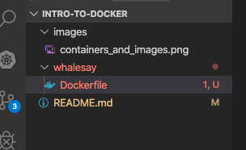

# Intro to Docker <!-- omit in toc -->

This repository was created for the Intro to [Docker] workshop at TCcodes.  

- [Getting Started](#getting-started)
  - [Hello World](#hello-world)
  - [The `docker` command](#the-docker-command)
- [Images and Containers](#images-and-containers)
  - [Your first image](#your-first-image)
    - [The Dockerfile](#the-dockerfile)
    - [Building the Image](#building-the-image)
    - [Running the Image](#running-the-image)
    - [Tagging the Image](#tagging-the-image)
- [Dockerizing a Node Application](#dockerizing-a-node-application)
  - [Initialize the application](#initialize-the-application)
  - [Creating the Express server](#creating-the-express-server)


## Getting Started

### Hello World

As with any new development technology Docker has a `hello-world` image you can use to 
make sure your [Docker] environment is setup correctly.  

Run the following command

```
docker run hello-world
```

You should see the following output:

```
Unable to find image 'hello-world:latest' locally
latest: Pulling from library/hello-world
1b930d010525: Pull complete 
Digest: sha256:4df8ca8a7e309c256d60d7971ea14c27672fc0d10c5f303856d7bc48f8cc17ff
Status: Downloaded newer image for hello-world:latest

Hello from Docker!
This message shows that your installation appears to be working correctly.

To generate this message, Docker took the following steps:
 1. The Docker client contacted the Docker daemon.
 2. The Docker daemon pulled the "hello-world" image from the Docker Hub.
    (amd64)
 3. The Docker daemon created a new container from that image which runs the
    executable that produces the output you are currently reading.
 4. The Docker daemon streamed that output to the Docker client, which sent it
    to your terminal.

To try something more ambitious, you can run an Ubuntu container with:
 $ docker run -it ubuntu bash

Share images, automate workflows, and more with a free Docker ID:
 https://hub.docker.com/

For more examples and ideas, visit:
 https://docs.docker.com/get-started/
```

### The `docker` command

The [docker cli] is the main application for creating, managing, and distributing
[Docker] containers.

The [docker cli] has many sub commands that make it very powerful.  We will not cover 
all of the commands in this lesson.  

To see the full list of possible commands run:

```
docker
```

Output:
```

Usage:	docker [OPTIONS] COMMAND

A self-sufficient runtime for containers

Options:
      --config string      Location of client config files (default
                           "/Users/derek/.docker")
  -c, --context string     Name of the context to use to connect to
                           the daemon (overrides DOCKER_HOST env var
                           and default context set with "docker
                           context use")
  -D, --debug              Enable debug mode
  -H, --host list          Daemon socket(s) to connect to
  -l, --log-level string   Set the logging level
                           ("debug"|"info"|"warn"|"error"|"fatal")
                           (default "info")
      --tls                Use TLS; implied by --tlsverify
      --tlscacert string   Trust certs signed only by this CA (default
                           "/Users/derek/.docker/ca.pem")
      --tlscert string     Path to TLS certificate file (default
                           "/Users/derek/.docker/cert.pem")
      --tlskey string      Path to TLS key file (default
                           "/Users/derek/.docker/key.pem")
      --tlsverify          Use TLS and verify the remote
  -v, --version            Print version information and quit

Management Commands:
  builder     Manage builds
  config      Manage Docker configs
  container   Manage containers
  context     Manage contexts
  image       Manage images
  network     Manage networks
  node        Manage Swarm nodes
  plugin      Manage plugins
  secret      Manage Docker secrets
  service     Manage services
  stack       Manage Docker stacks
  swarm       Manage Swarm
  system      Manage Docker
  trust       Manage trust on Docker images
  volume      Manage volumes

Commands:
  attach      Attach local standard input, output, and error streams to a running container
  build       Build an image from a Dockerfile
  commit      Create a new image from a container's changes
  cp          Copy files/folders between a container and the local filesystem
  create      Create a new container
  diff        Inspect changes to files or directories on a container's filesystem
  events      Get real time events from the server
  exec        Run a command in a running container
  export      Export a container's filesystem as a tar archive
  history     Show the history of an image
  images      List images
  import      Import the contents from a tarball to create a filesystem image
  info        Display system-wide information
  inspect     Return low-level information on Docker objects
  kill        Kill one or more running containers
  load        Load an image from a tar archive or STDIN
  login       Log in to a Docker registry
  logout      Log out from a Docker registry
  logs        Fetch the logs of a container
  pause       Pause all processes within one or more containers
  port        List port mappings or a specific mapping for the container
  ps          List containers
  pull        Pull an image or a repository from a registry
  push        Push an image or a repository to a registry
  rename      Rename a container
  restart     Restart one or more containers
  rm          Remove one or more containers
  rmi         Remove one or more images
  run         Run a command in a new container
  save        Save one or more images to a tar archive (streamed to STDOUT by default)
  search      Search the Docker Hub for images
  start       Start one or more stopped containers
  stats       Display a live stream of container(s) resource usage statistics
  stop        Stop one or more running containers
  tag         Create a tag TARGET_IMAGE that refers to SOURCE_IMAGE
  top         Display the running processes of a container
  unpause     Unpause all processes within one or more containers
  update      Update configuration of one or more containers
  version     Show the Docker version information
  wait        Block until one or more containers stop, then print their exit codes

Run 'docker COMMAND --help' for more information on a command.
```

For this lesson we are going to focs on the `run`, `build`, `pull`, and `push` commands.

## Images and Containers

[Docker] uses **images** and **containers** to encapsulate and distribute your applications.
**Images** are snapshots of your application that contain environment settings,
configs, and other dependencies.  **Containers** are a running instance of an **image**.  When you execute `docker run` the [Docker] system will create a **container** that is executing.  Take a look at the digram below to see how this works.  In the digram you will see:

  - **Linux Operating System** - Provides managent of resources such as CPU, Memory, Network, and File System.
  - **Docker** - The docker system used to start, run, and manage **containers**.
  - **Container** - Provides the environment for running the image.  It has its own set of environment variables, and is completely isolated from any other running containers, or applications on the host.
  - **Image** - Provides the definition of **what** to run.  This is where you have the executables for things like MySQL, Nginx, Mongodb, etc.

<p align="center">
    
</p>

### Your first image

For this part of the lesson we are going to use the [whalesay]
image to show create or own image.

To see what the [whalesay] image does, run the following command:

```
docker run docker/whalesay cowsay 'Hello tccodes!'
```

The output will look like this:

```
 ________________ 
< Hello tccodes! >
 ---------------- 
    \
     \
      \     
                    ##        .            
              ## ## ##       ==            
           ## ## ## ##      ===            
       /""""""""""""""""___/ ===        
  ~~~ {~~ ~~~~ ~~~ ~~~~ ~~ ~ /  ===- ~~~   
       \______ o          __/            
        \    \        __/             
          \____\______/  
```

#### The Dockerfile

[Docker] uses a file called [Dockerfile] to define the instructions for building an
image. We will create a [Dockerfile] that builds on top of the [whalesay] image and 
creates a new image containing our arguments of what we want the whale to say.

Create a new directory in [VS Code] named `whalesay`.  Then create a new file and name 
it `Dockerfile`.  Notice that [VS Code] will recognize the file as a docker file.



Add the following to the [Dockerfile] you created.

```dockerfile
# Defines what image we want to start from
# TIP: You can start from your own images
FROM docker/whalesay

# A helpful label to know who created this
LABEL MAINTAINER="Derek Smith"

# Overriding the command to provide our own arguments
CMD ["cowsay", "Hello from Derek!"]
```

#### Building the Image

Now that we have a valid [Dockerfile] we can build our image using the `docker build` command.

To build the file run:

```
docker build .
```

You should see something like this:
```
Sending build context to Docker daemon  2.048kB
Step 1/3 : FROM docker/whalesay
 ---> 6b362a9f73eb
Step 2/3 : LABEL MAINTAINER="Derek Smith"
 ---> Running in 86b88456758b
Removing intermediate container 86b88456758b
 ---> ce0bc3c90da1
Step 3/3 : CMD ["coway", "Hello from Derek!"]
 ---> Running in 4754e0ea1449
Removing intermediate container 4754e0ea1449
 ---> a2c434e73458
Successfully built a2c434e73458
```

**What's going on here?**

The first line `Sending build context to Docker daemon  2.048kB` is creating the **context** for building the container.  The final argument of the `build` command defines the context, which we provide `.` in our example. The `.` is short for the current directory.  

> IMPORANT: Docker cannot see ANYTHING outside of the context you provide it.  
> This was done for security purposes.  For example, you cannt include a file that
> is above the context folder in your image such as (..\..\config.json).

```
Step 1/3 : FROM docker/whalesay
 ---> 6b362a9f73eb
 ``` 
These lines are saying that this image will start from the image identified with 
the SHA hash of `6b362a9f73eb`. Each docker image has a unique SHA hash that
identifies the image.  The `docker/whalesay` is a **tag** that is applied to make it
easier to find. 

```
Step 2/3 : LABEL MAINTAINER="Derek Smith"
 ---> Running in 86b88456758b
```
There is another imporant thing going on here.  Notice that after each **step** we 
get a new SHA hash. This is because docker images are built on layers, and the
combination of layers make up the final image.  The use of layers is key to how
works and has many advantages such as:

   - **Immutable/Reusable** - Each layer is immutable meaning it can never change.  Keeping the layers small allows docker systems to effeciently download and cache the layers that are used frequently.
   - **Optimize Build** - Because each layer contains the results of a single action, docker can reuse the layers that haven't changed on each build.
   - **Optimzed Storage** - If you run 100 containers that were built on the **NodeJS** image, docker only has to store one copy of that image.

```
Successfully built a2c434e73458
```
Finally docker is telling us that it successfully built our image, and the SHA hash for that image is `a2c434e73458`.  We can how use that SHA to reference our image when ever we want to use it.

#### Running the Image

To run the image we just created run the following command:

```
docker run --rm a2c434e73458
```

> The `--rm` just tells docker to delete the container when it is done running.  Without this it would keep it around, which we don't want.

You should see the command we provided in the build.

```
< Hello from Derek! >
 ------------------- 
    \
     \
      \     
                    ##        .            
              ## ## ##       ==            
           ## ## ## ##      ===            
       /""""""""""""""""___/ ===        
  ~~~ {~~ ~~~~ ~~~ ~~~~ ~~ ~ /  ===- ~~~   
       \______ o          __/            
        \    \        __/             
          \____\______/   
```

Great, now anyone in the world can run our image and get the same result!

#### Tagging the Image

SHA hashes aren't exactly easy to remember (kind of like IP Addresses).  So docker gives us a way to apply names to the images with **tags**.  This will make it easier 
for us to distribute and reuse our images.

Let's run `docker build` command again, but this time apply a tag.

```
docker build -t mywhalesay .
```

The output will look like this.

```
Sending build context to Docker daemon  2.048kB
Step 1/3 : FROM docker/whalesay
 ---> 6b362a9f73eb
Step 2/3 : LABEL MAINTAINER="Derek Smith"
 ---> Using cache
 ---> ce0bc3c90da1
Step 3/3 : CMD ["cowsay", "Hello from Derek!"]
 ---> Using cache
 ---> 7f8ffcff3355
Successfully built 7f8ffcff3355
Successfully tagged mywhalesay:latest
```

It looks almost identical to the previous build, however there is a new line at the end. 
```
Successfully tagged mywhalesay:latest
```

You are probably wondering where `:latest` came from, since we did not type it above. 
[Tags] come in the form of `IMAGE[:TAG]` where the actual `TAG` portion is optional. If
you do not supply it, [Docker] will default to `:latest`.  It also defaults it to `:latest` using the run command. 

```
docker run mywhalesah
```

Will output
``` 
___________________ 
< Hello from Derek! >
 ------------------- 
    \
     \
      \     
                    ##        .            
              ## ## ##       ==            
           ## ## ## ##      ===            
       /""""""""""""""""___/ ===        
  ~~~ {~~ ~~~~ ~~~ ~~~~ ~~ ~ /  ===- ~~~   
       \______ o          __/            
        \    \        __/             
          \____\______/  
```

Let's do something else like create two versions of our image to see how this works. 
Run the following command to also tag our `:latest` image with `:1.0`

```
docker tag mywhalesay:latest mywhalesay:1.0
```

Now go back to your [Dockerfile] and add `v2.0` to the message.  Our [Dockerfile] will
look like this.

```dockerfile
# Defines what image we want to start from
# TIP: You can start from your own images
FROM docker/whalesay

# A helpful label to know who created this
LABEL MAINTAINER="Derek Smith"

# Overriding the command to provide our own arguments
CMD ["cowsay", "Hello from Derek! v2.0"]
```

If we build our image again, we will get the new image and it will take over the `:latest` tag.

```
docker build -t mywhalesay .
```

Again the output looks like this.
```
Sending build context to Docker daemon  2.048kB
Step 1/3 : FROM docker/whalesay
 ---> 6b362a9f73eb
Step 2/3 : LABEL MAINTAINER="Derek Smith"
 ---> Using cache
 ---> ce0bc3c90da1
Step 3/3 : CMD ["cowsay", "Hello from Derek!"]
 ---> Using cache
 ---> 7f8ffcff3355
Successfully built 7f8ffcff3355
Successfully tagged mywhalesay:latest
```

> Notice how the output now shows `---> Using cache` for the images in steps 2 and 3. Docker is saying it doesn't need to rebuild that image because nothing has changed.

If we run our container now we will see the new message.

```
docker run --rm mywhalesay
```

The output will be.

```
 ________________________ 
< Hello from Derek! v2.0 >
 ------------------------ 
    \
     \
      \     
                    ##        .            
              ## ## ##       ==            
           ## ## ## ##      ===            
       /""""""""""""""""___/ ===        
  ~~~ {~~ ~~~~ ~~~ ~~~~ ~~ ~ /  ===- ~~~   
       \______ o          __/            
        \    \        __/             
          \____\______/   
```

Now, we can run still run our `1.0` image because we tagged it with something other than `:latest`.

```
docker run --rm mywhalesay:1.0
```

Will output our original message.
```
 ___________________ 
< Hello from Derek! >
 ------------------- 
    \
     \
      \     
                    ##        .            
              ## ## ##       ==            
           ## ## ## ##      ===            
       /""""""""""""""""___/ ===        
  ~~~ {~~ ~~~~ ~~~ ~~~~ ~~ ~ /  ===- ~~~   
       \______ o          __/            
        \    \        __/             
          \____\______/   
```


## Dockerizing a Node Application

Now that we can create docker images and containers, we are going to take a look at
how you would build a real application image. For this part of the lesson we will
build a simlpe [express] server using [NodeJS].

### Initialize the application

To get started we will create and intiailize a [NodeJS] application.

Create a new folder named **node-example**.  Then run the following command 
inside the new folder.  Press enter to accept all the defaults.

```
npm init

This utility will walk you through creating a package.json file.
It only covers the most common items, and tries to guess sensible defaults.

See `npm help json` for definitive documentation on these fields
and exactly what they do.

Use `npm install <pkg>` afterwards to install a package and
save it as a dependency in the package.json file.

Press ^C at any time to quit.
package name: (example) 
version: (1.0.0) 
description: 
entry point: (index.js) 
test command: 
git repository: 
keywords: 
author: 
license: (ISC) 
About to write to .../tccodes-repo/intro-to-docker/node-example/package.json:

{
  "name": "example",
  "version": "1.0.0",
  "description": "",
  "main": "index.js",
  "scripts": {
    "test": "echo \"Error: no test specified\" && exit 1"
  },
  "author": "",
  "license": "ISC"
}


Is this OK? (yes) 
```

### Creating the Express server

Install the [express] library
```
npm install --save express
```

Next, create a file name `index.js` with the following content.

```javascript
const express = require('express')
const app = express()
const port = 3000

app.get('/', (req, res) => res.send('Hello World!'))

app.listen(port, () => console.log(`Example app listening on port ${port}!`))
```

Finally, lets edit the `package.json` to set up the **start** script.

```
{
  "name": "example",
  "version": "1.0.0",
  "description": "",
  "main": "index.js",
  "scripts": {
    "start": "node index.js",
    "test": "echo \"Error: no test specified\" && exit 1"
  },
  "author": "",
  "license": "ISC",
  "dependencies": {
    "express": "^4.17.1"
  }
}
```

We can run our app using the following command.
```
npm run start

> example@1.0.0 start /Users/derek/Projects/tccodes-repo/intro-to-docker/node-example
> node index.js

Example app listening on port 3000!
```

In order to make this app a little more realistic we will serve a static web page from the 
server.  

Create a new folder named **public** in the **node-example** directory.  Then add a file 
named **index.html** with the following contents.

```html
<html>
<head>
    <title>TCCodes Node App</title>
</head>
<body>
    <p>Checkout TCCodes!</p>
</body>
</html>
```

Finally, change the `index.js` file to use the `express.static()` middleware.

```javascript
const express = require('express')
const app = express()
const port = 3000

// app.get('/', (req, res) => res.send('Hello World!'))
app.use(express.static('public'));

app.listen(port, () => console.log(`Example app listening on port ${port}!`))
```


[Docker]: https://www.docker.com/
[docker cli]: https://docs.docker.com/engine/reference/commandline/cli/
[whalesay]: https://hub.docker.com/r/docker/whalesay/
[Dockerfile]: https://docs.docker.com/engine/reference/builder/
[NodeJS]: https://nodejs.org/en/
[express]: https://expressjs.com/